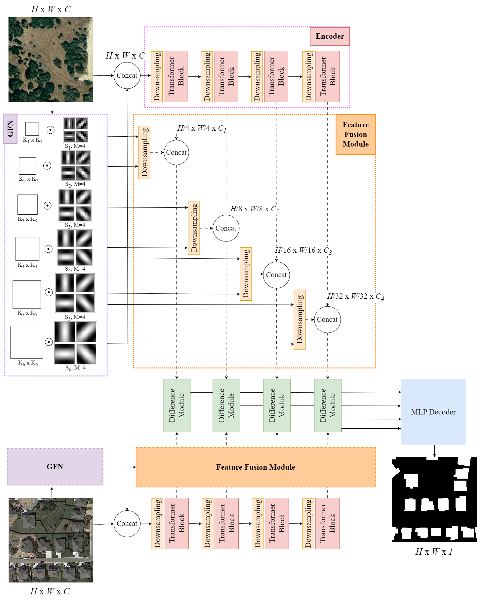

# GabFormer

[](https://www.python.org/)
[](https://GitHub.com/Naereen/ama)
<!-- [](https://www.python.org/) -->

<div align="center">

</div>

<br>
<!-- (to be updated) -->
<!-- The official implementation of [Gabor Feature Network for Transformer-based Building Change Detection Model in Remote Sensing]() (ICIP 2024) -->
The official implementation of **Gabor Feature Network for Transformer-based Building Change Detection Model in Remote Sensing** (ICIP 2024) <br>

[Link of the paper](https://hal.science/hal-04619245)
<br>

## :rice_ball: Dependencies
You can create an Anaconda environment named ``GabFormer`` from `environment.yml`.
```
conda env create -f environment.yml
conda activate GabFormer
```

## :fork_and_knife: Installation

Clone this repo:

```shell
git clone https://github.com/Ayana-Inria/GabFormer.git
cd GabFormer
```

<!-- ## :ramen: Quick Start on LEVIR dataset

We have some samples from the [`LEVIR-CD`](https://justchenhao.github.io/LEVIR/) dataset in the folder `samples_LEVIR` for a quick start.

Firstly, you can download our ChangeFormerV6 pretrained model——by [`DropBox`](https://www.dropbox.com/sh/xoswrsu9n4ypr5h/AAAmUOE-DTq59fX-tE2TwPzKa?dl=0) or [`Github`](https://github.com/wgcban/ChangeFormer/releases/download/v0.1.0/CD_ChangeFormerV6_LEVIR_b16_lr0.0001_adamw_train_test_200_linear_ce_multi_train_True_multi_infer_False_shuffle_AB_False_embed_dim_256.zip). After downloaded the pretrained model, you can put it in `checkpoints/ChangeFormer_LEVIR/`.

Then, run a demo to get started as follows:

```python
python demo_LEVIR.py
```

After that, you can find the prediction results in `samples/predict_LEVIR`. -->


## :bread: Training
1. Change the dataset path in `data_config.py`.
2. Set the training parameter and model's hyperparameters in the training script `run_GabFormer.sh` in the folder `scripts`. You can run the script file by `sh scripts/run_GabFormer.sh` in the command environment.

## :ice_cream: Inference

You can find the evaluation script `eval_GabFormer.sh` in the folder `scripts`. You can run the script file by `sh scripts/eval_GabFormer.sh` in the command environment.


## :lollipop: Dataset Preparation

### :tea: Data structure

```
"""
data structure
-dataroot
    ├─A
        ├─img1.png
        ...
    ├─B
        ├─img1.png
        ...
    ├─label
        ├─img1.png
        ...
    └─list
        ├─val.txt
        ├─test.txt
        └─train.txt

# In list/ folder, prepare text files of the splits and list down all filenames of each split
   # for example:
       list/train.txt
           img1.png
           img32.png
           ...
       list/test.txt
           img2.png
           img15.png
           ...
       list/val.txt
           img54.png
           img100.png
           ...
"""
```

`A`: pre-change images;

`B`: post-change images;

`label`: binary labels;

`list`: contains `train.txt, val.txt and test.txt`, each file records the image names (XXX.png) in the change detection dataset.

### :cookie: Dataset
GabFormer was tested on two datasets for remote sensing building change detection. 

1. LEVIR-CD
    * Paper: [A Spatial-Temporal Attention-Based Method and a New Dataset for Remote Sensing Image Change Detection ](https://www.mdpi.com/2072-4292/12/10/1662)
    * Download: [Link](https://justchenhao.github.io/LEVIR/)

2. WHU-CD
    * Paper: [Fully convolutional networks for multisource building extraction from an open aerial and satellite imagery data set](https://ieeexplore.ieee.org/document/8444434)
    * Download: [Link](https://study.rsgis.whu.edu.cn/pages/download/)
    
We utilized the same cropping method as what is provided [here](https://github.com/Ayana-Inria/AYANet) to the size of 256 x 256.

## :trollface: License
The code is released under the GPL-3.0-only license. See `LICENSE` file for more details.

## :full_moon_with_face: Citation

If you use this code for your research, please cite our paper (to be updated):

```
@inproceedings{GabFormer,
      title={Gabor Feature Network for Transformer-based Building Change Detection Model in Remote Sensing}, 
      author={Priscilla Indira Osa and Josiane Zerubia and Zoltan Kato},
      year={2024},
      
}
```

##  :paw_prints: Acknowledgement
Our GabFormer is implemented based on the code provided in repositories below:
- https://github.com/wgcban/ChangeFormer
- https://github.com/jxgu1016/Gabor_CNN_PyTorch

