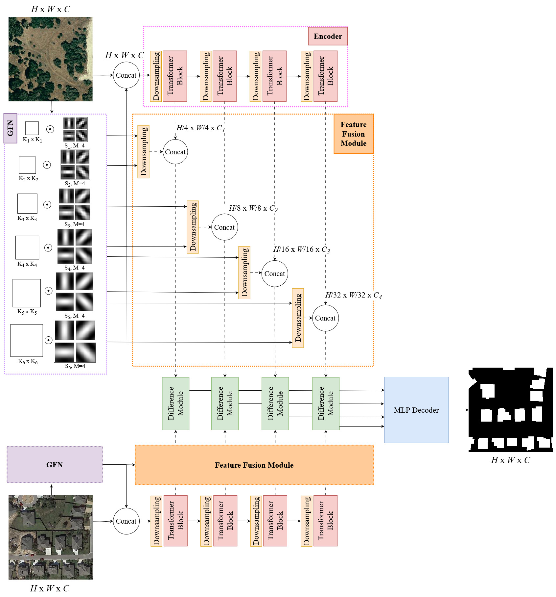

# GabFormer

TO BE RESTRUCTURED :wrench: AND CLEANED :bathtub:

## :rice: Network Architecture



## :rice_ball: Dependencies
All packages are listed in `requirements.txt`.
You can create a virtual ``conda`` environment named ``GabFormer`` with the following command:

```
conda create -n GabFormer --file requirements.txt
conda activate GabFormer
```

## :fork_and_knife: Installation

Clone this repo:

```shell
git clone https://github.com/Ayana-Inria/GabFormer.git
cd GabFormer
```

<!-- ## :ramen: Quick Start on LEVIR dataset

We have some samples from the [`LEVIR-CD`](https://justchenhao.github.io/LEVIR/) dataset in the folder `samples_LEVIR` for a quick start.

Firstly, you can download our ChangeFormerV6 pretrained model——by [`DropBox`](https://www.dropbox.com/sh/xoswrsu9n4ypr5h/AAAmUOE-DTq59fX-tE2TwPzKa?dl=0) or [`Github`](https://github.com/wgcban/ChangeFormer/releases/download/v0.1.0/CD_ChangeFormerV6_LEVIR_b16_lr0.0001_adamw_train_test_200_linear_ce_multi_train_True_multi_infer_False_shuffle_AB_False_embed_dim_256.zip). After downloaded the pretrained model, you can put it in `checkpoints/ChangeFormer_LEVIR/`.

Then, run a demo to get started as follows:

```python
python demo_LEVIR.py
```

After that, you can find the prediction results in `samples/predict_LEVIR`. -->


## :bread: Train on LEVIR-CD

You can find the training script `run_ChangeFormer_LEVIR.sh` in the folder `scripts`. You can run the script file by `sh scripts/run_ChangeFormer_LEVIR.sh` in the command environment.

The detailed script file `run_ChangeFormer_LEVIR.sh` is as follows:

```cmd
#!/usr/bin/env bash

#GPUs
gpus=0

#Set paths
checkpoint_root=/media/lidan/ssd2/ChangeFormer/checkpoints
vis_root=/media/lidan/ssd2/ChangeFormer/vis
data_name=LEVIR


img_size=256    
batch_size=16   
lr=0.0001         
max_epochs=200
embed_dim=256

net_G=ChangeFormerV6        #ChangeFormerV6 is the finalized verion

lr_policy=linear
optimizer=adamw                 #Choices: sgd (set lr to 0.01), adam, adamw
loss=ce                         #Choices: ce, fl (Focal Loss), miou
multi_scale_train=True
multi_scale_infer=False
shuffle_AB=False

#Initializing from pretrained weights
pretrain=/media/lidan/ssd2/ChangeFormer/pretrained_segformer/segformer.b2.512x512.ade.160k.pth

#Train and Validation splits
split=train         #train
split_val=test      #test, val
project_name=CD_${net_G}_${data_name}_b${batch_size}_lr${lr}_${optimizer}_${split}_${split_val}_${max_epochs}_${lr_policy}_${loss}_multi_train_${multi_scale_train}_multi_infer_${multi_scale_infer}_shuffle_AB_${shuffle_AB}_embed_dim_${embed_dim}

CUDA_VISIBLE_DEVICES=1 python main_cd.py --img_size ${img_size} --loss ${loss} --checkpoint_root ${checkpoint_root} --vis_root ${vis_root} --lr_policy ${lr_policy} --optimizer ${optimizer} --pretrain ${pretrain} --split ${split} --split_val ${split_val} --net_G ${net_G} --multi_scale_train ${multi_scale_train} --multi_scale_infer ${multi_scale_infer} --gpu_ids ${gpus} --max_epochs ${max_epochs} --project_name ${project_name} --batch_size ${batch_size} --shuffle_AB ${shuffle_AB} --data_name ${data_name}  --lr ${lr} --embed_dim ${embed_dim}
```

## :ice_cream: Evaluate on LEVIR-CD

You can find the evaluation script `eval_ChangeFormer_LEVIR.sh` in the folder `scripts`. You can run the script file by `sh scripts/eval_ChangeFormer_LEVIR.sh` in the command environment.

The detailed script file `eval_ChangeFormer_LEVIR.sh` is as follows:

```cmd
#!/usr/bin/env bash

gpus=0

data_name=LEVIR
net_G=ChangeFormerV6 #This is the best version
split=test
vis_root=/media/lidan/ssd2/ChangeFormer/vis
project_name=CD_ChangeFormerV6_LEVIR_b16_lr0.0001_adamw_train_test_200_linear_ce_multi_train_True_multi_infer_False_shuffle_AB_False_embed_dim_256
checkpoints_root=/media/lidan/ssd2/ChangeFormer/checkpoints
checkpoint_name=best_ckpt.pt
img_size=256
embed_dim=256 #Make sure to change the embedding dim (best and default = 256)

CUDA_VISIBLE_DEVICES=0 python eval_cd.py --split ${split} --net_G ${net_G} --embed_dim ${embed_dim} --img_size ${img_size} --vis_root ${vis_root} --checkpoints_root ${checkpoints_root} --checkpoint_name ${checkpoint_name} --gpu_ids ${gpus} --project_name ${project_name} --data_name ${data_name}
```

## :lollipop: Dataset Preparation

### :tea: Data structure

```
"""
data structure
-dataroot
    ├─A
        ├─img1.png
        ...
    ├─B
        ├─img1.png
        ...
    ├─label
        ├─img1.png
        ...
    └─list
        ├─val.txt
        ├─test.txt
        └─train.txt

# In list/ folder, prepare text files of the splits and list down all filenames of each split
   # for example:
       list/train.txt
           img1.png
           img32.png
           ...
       list/test.txt
           img2.png
           img15.png
           ...
       list/val.txt
           img54.png
           img100.png
           ...
"""
```

`A`: pre-change images;

`B`: post-change images;

`label`: binary labels;

`list`: contains `train.txt, val.txt and test.txt`, each file records the image names (XXX.png) in the change detection dataset.

### :coffee: Links to download processed datsets used for train/val/test

You can download the processed LEVIR-CD by the DropBox through the following here:

- LEVIR-CD-256: [`click here to download`](https://www.dropbox.com/sh/lnjxpflvgjijwoj/AAAgWr3xgOjqtTWPVpbLVcfNa?dl=0)


Since the file sizes are large, I recommed to use command line and cosider downloading the zip file as follows (in linux):

To download LEVIR-CD dataset run following command in linux-terminal:
```cmd
wget https://www.dropbox.com/s/h9jl2ygznsaeg5d/LEVIR-CD-256.zip
```

For your reference, I have also attached the links to original LEVIR-CD here: [`LEVIR-CD`](https://justchenhao.github.io/LEVIR/).


## :trollface: License
The code is released under the GPL-3.0-only license. See `LICENSE` file for more details.

<!-- ## :full_moon_with_face: Citation

If you use this code for your research, please cite our paper:

```
@misc{bandara2022transformerbased,
      title={A Transformer-Based Siamese Network for Change Detection}, 
      author={Wele Gedara Chaminda Bandara and Vishal M. Patel},
      year={2022},
      eprint={2201.01293},
      archivePrefix={arXiv},
      primaryClass={cs.CV}
}
``` -->

##  :paw_prints: References
Our GabFormer is implemented based on the code provided in repository below:

- https://github.com/wgcban/ChangeFormer

